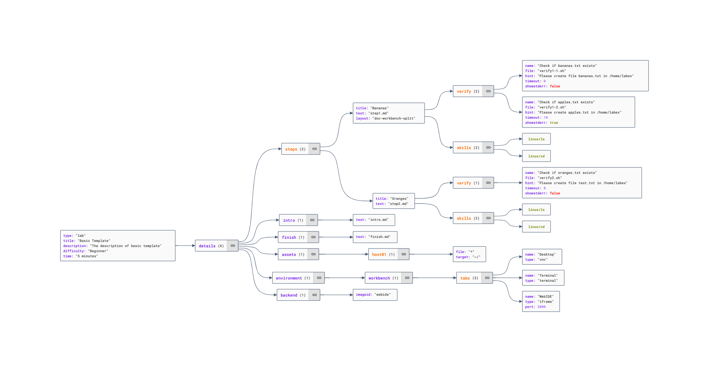

# How to Start

## Prerequisites

To author interactive labs and challenges, you must already be familiar with the following:

- Using the Linux command-line interface (Specifically, a bash terminal).
- [Git](https://docs.github.com/en/get-started/using-git/about-git) (Cloning a repository, making commits, and pushing commits to a server).
- [Markdown](https://docs.github.com/en/get-started/writing-on-github/getting-started-with-writing-and-formatting-on-github/basic-writing-and-formatting-syntax) (Writing text and basic formatting syntax).
- JSON (Config file format).

Of course, you'll also need expertise in the subject matter of your labs.

## Woking with GitHub Repository

We have created a GitHub repository that contains multiple folders, with one folder for each Lab.

```
repo-name
├── first-lab/challenge-name
├── second-lab/challenge-name
└── third-lab/challenge-name
```

Each folder already includes all the essential elements for a lab/challenge.

Look inside the folder:

```
repo-name
├── first-lab/challenge-name
    ├── index.json
    └── setup.sh
    ├── intro.md
    └── finish.md
    ├── step1.md
    ├── verify1-1.sh
    └── verify1-2.sh
    ├── step2.md
    └── verify2.sh
    └── assets/
    └── solutions/
```

Note:

- `index.json`: the config file for your scenario, including where you specify the title, description, level, and estimated time to complete, as shown to learners. **Learn more about** [**index.json**](https://www.katacoda.community/essentials/scenario-syntax.html#understanding-katacoda-s-index-json)**.**
- `intro.md` and `finish.md`: Markdown files for the text shown at the start and end of the Lab. Format requirements are detailed in the template experiment.
- `setup.sh`: a shell script executed at the lab environment starting.
- `step*.md`: Markdown files for the lesson text are shown alongside each "step" of the Lab.
- `verify*.sh`: (Optional) Shell scripts executed to verify the steps are complete. One step can have single or multiple verification scripts. Some steps may not need verification scripts.
- `assets`: (Optional) the folder includes all the example data or supporting files used in the Lab.
  - Including images of the markdown files, and images should be [compressed](https://tinypng.com/) to reduce the size of the repository.
- `solutions`: (Optional) the folder includes all the solution files of challenges. The lab will not include the solution files.

Most of the configuration items in the index.json file are already written. You must add the `steps` and `assets` in the `details` configuration item.

## index.json Configuration

This is a sample `index.json` file:

```json
{
    "type": "lab",
    "title": "Basic Template",
    "description": "The description of basic template",
    "difficulty": "Beginner",
    "time": "5 minutes",
    "details": {
        "steps": [
            {
                "title": "Bananas",
                "text": "step1.md",
                "verify": [
                    {
                        "name": "Check if bananas.txt exists",
                        "file": "verify1-1.sh",
                        "hint": "Please create file bananas.txt in /home/labex",
                        "timeout": 0,
                        "showstderr": false
                    },
                    {
                        "name": "Check if apples.txt exists",
                        "file": "verify1-2.sh",
                        "hint": "Please create apples.txt in /home/labex",
                        "timeout": 10,
                        "showstderr": true
                    }
                ],
                "skills": [
                    "linux/ls",
                    "linux/cd"
                ],
                "layout": "doc-workbench-split"
            },
            {
                "title": "Oranges",
                "text": "step2.md",
                "verify": [
                    {
                        "name": "Check if oranges.txt exists",
                        "file": "verify2.sh",
                        "hint": "Please create file test.txt in /home/labex",
                        "timeout": 0,
                        "showstderr": false
                    }
                ],
                "skills": [
                    "linux/ls",
                    "linux/cd"
                ]
            }
        ],
        "intro": {
            "text": "intro.md",
            "background": "setup.sh"
        },
        "finish": {
            "text": "finish.md"
        },
        "assets": {
            "host01": [
                {
                    "file": "*",
                    "target": "~/"
                }
            ]
        }
    },
    "backend": {
        "imageid": "vnc-ubuntu:2004"
    }
}
```

<figure><figcaption><p>A sample index.json</p></figcaption></figure>

The fields in `index.json` are explained in detail.

### Basic fields

```json
{
  "type": "lab",
  "title": "Basic Template",
  "description": "The description of basic template",
  "difficulty": "Beginner",
  "time": "5 minutes"
}
```

There are five basic fields in `index.json`:

1. `type`: The type of scenario must be `lab` or `challenge`. [See more details](labs-and-challenges.md)
2. `title`: The title of the scenario. Usually, the title is the same as the folder name.
3. `description`: The description of the scenario.
4. `time`: The estimated time to complete the scenario. e.g: "5 minutes", "15 minutes".
5. `difficulty`: The difficulty of scenario must be "Beginner", "Intermediate", or "Advanced".

The difficulty can be one of the following:

- `Beginner`: The Lab/Challenge contains only single or multiple skills **in the same skills group**. and the skills are easy. Usually, the Lab/Challenge is a single step.
- `Intermediate`: The Lab/Challenge contains multiple skills from **different skill groups**. and the skills are not very difficult.
- `Advanced`: The Lab/Challenge contains multiple skills from **different subjects or projects**. and the skills are more difficult. Usually, the Lab/Challenge is a multi-step Lab/Challenge.

_Our skills structure: skill > skill group > subject > project. e.g: cd > Directory Operations > Linux Commands > Linux_

### Details fields

Details fields are the most important fields in `index.json`. The `details` field contains the following items:

#### Steps

The `intro` and `finish` items are the configuration of the start and end of the Lab. Both are special steps, and default to `doc-fullscreen` layout.

```json
"intro": {
  "text": "intro.md",
  "background": "setup.sh"
},
"finish": {
  "text": "finish.md"
}
```

If `setup.sh` is specified in the `background` item, the script will be executed when the Lab starts.

Other `steps` item specifies the steps of the lab.

```json
"steps": [
  {
    "title": "Bananas",
    "text": "step1.md",
    "verify": [
      {
        "name": "Check if bananas.txt exists",
        "file": "verify1-1.sh",
        "hint": "Please create file bananas.txt in /home/labex",
        "timeout": 0,
        "showstderr": false
      },
      {
        "name": "Check if apples.txt exists",
        "file": "verify1-2.sh",
        "hint": "Please create apples.txt in /home/labex",
        "timeout": 10,
        "showstderr": true
      }
    ],
    "skills": ["linux/ls", "linux/cd"],
    "layout": "doc-workbench-split"
  }
]
```

The parameters of the steps are:

1. `title`: The title of the step. It will be displayed to the learner, so it should be clear and concise.
2. `text`: The markdown file of the step. The name of the markdown file.
3. `verify`: The `verify` parameter contains a series of verification scripts that will be executed **in order**. The parameters of the verification scripts are:
   1. `name`: The purpose of the script. It will be displayed to the learner, so it should be clear and concise.
   2. `file`: The name of the script.
   3. `hint`: The message when the script is unsuccessful will be displayed to the learner, so it should be clear and concise.
   4. `timeout`: Default `0`, which means no limit on the execution time of the script, if set, it means a limit on the number of seconds to execute.
   5. `showstderr`: Default is `false`, set to true to show stderr returned by the script, and no longer displays hint.
4. `skills`: The skills of the step. it comes from the official skills tree. [See more details](introduction-of-skill-tree.md).
5. `layout`: (Optional) The layout of the step, must be `doc-workbench-split` or `doc-fullscreen`. Intro and finish step default to `doc-fullscreen`, other steps default to `doc-workbench-split` if not filled.

#### Assets

The `assets` item specifies which assets you want to be copied to the lab environment at runtime. The default name of your lab environment is `host01`, and you can copy all files to the home folder of the default login user.

```json
"assets": {
    "host01": [
        { "file": "*", "target": "~/" }
    ]
}
```

Note that the target directory can be anything you want. In this example, `~/` maps to `/home/labex`, since `labex` is the default user, and `/home/labex` is that user's home directory.

The example below copies over three specific assets. Instead of using the `*` wildcard to select all assets, two files are copied into the home directory, while a third is copied into `/usr/local/bin`, and its permissions are set to executable.

```json
"assets": {
    "host01": [
        {"file": "sample_code.py", "target": "~/" },
        {"file": "sample_data.csv", "target": "~/" },
        {"file": "sneaky_script.sh", "target": "/usr/local/bin/", "chmod": "+x"}
    ]
}
```

Keep your assets lightweight; each is limited to 9 MB per file. There is no limit to the number of assets, but using more assets will increase the loading time of the Lab.

The verification script is executed when the learner completes a step and clicks the `Next` button. It runs in the background until it returns an exit code of zero (success), at which point the step is flagged as completed, and the lab proceeds to display the next step. No parameters are passed to the verification script, and the script is expected to return the standard zero for success or non-zero for failure.

## Backend fields

The `backend` item specifies the backend of the lab. Now only support `vnc-ubuntu:2004`, `webide-ubuntu:2004`.
