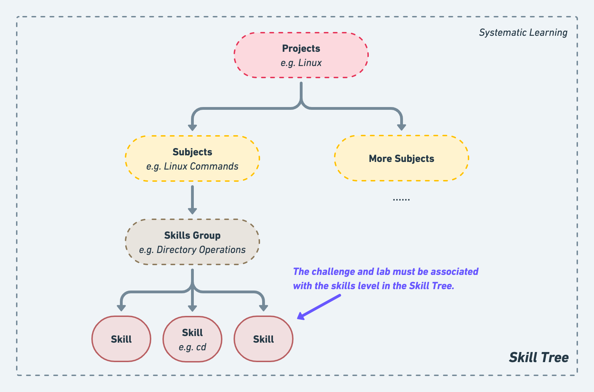

# Introduction of Skill Tree

## What is a Skill Tree?

Skill Tree is LabEx's resource skeleton, linking different challenges and labs.

<figure><figcaption>Skill Tree</figcaption></figure>

Skill Tree is officially defined based on the technical direction, and the skills associated with each challenge and lab are derived from Skill Tree.LabEx keeps up to date with the latest Skill Tree, our content production trend.

Authors can suggest to LabEx if they need to add a skill to a challenge and lab that does not exist in the Skill Tree.


The latest [**Skills Tree**](https://lanqiao-courses.feishu.cn/base/bascnAjCGlkCStPvz83nmAfORUh)**.**

