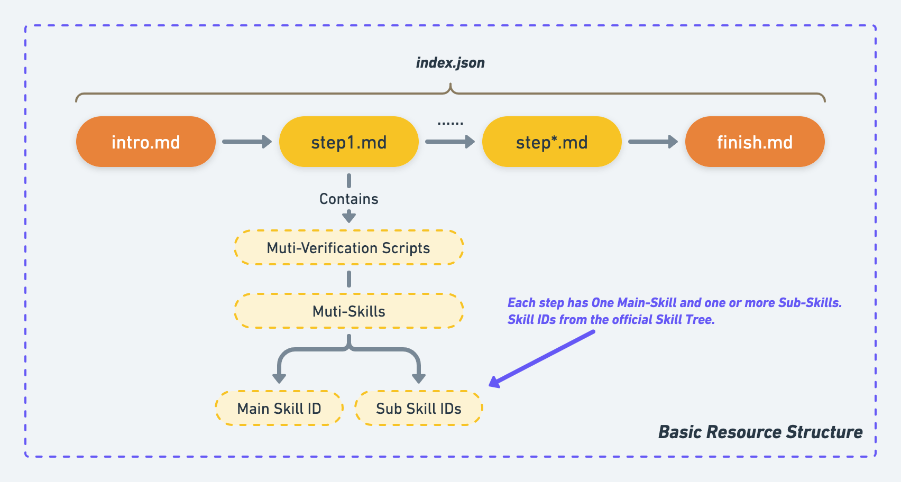

# Introduction of Skill Tree

## What is a Skill Tree?

Skill Tree is LabEx's resource skeleton, linking different challenges and labs.

<figure><figcaption>Skill Tree</figcaption></figure>

Skill Tree is officially defined based on the technical direction, and the skills associated with each challenge and lab are derived from Skill Tree. We will keep up to date with the latest Skill Tree.

Authors can suggest to LabEx if they need to add a skill to a challenge and lab that does not exist in the Skill Tree.


The latest [**Skills Tree**](https://lanqiao-courses.feishu.cn/base/bascnAjCGlkCStPvz83nmAfORUh).


## Associated With Steps

The steps of the challenge and lab are associated with the skills of the Skill Tree.

<figure><figcaption><p>The Structure of Labs and Challenges</p></figcaption></figure>

You need to copy the **Skill IDs** from the latest [**Skills Tree**](https://lanqiao-courses.feishu.cn/base/bascnAjCGlkCStPvz83nmAfORUh), and paste it into the `index.json`:

```json
"steps": [
    {
    "title": "Bananas", // The title of the step.
    "text": "step1.md", // The markdown file of the step.
    "verify": [],
    "skills": ["linux/ls", "linux/cd"] // The skill ids of the step.
}]
```

The main skill id of this step must be put in the first place.
